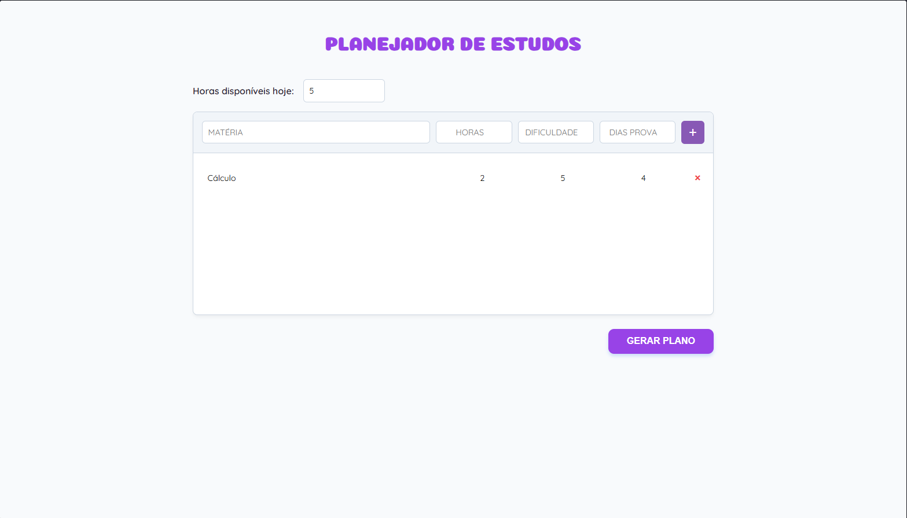
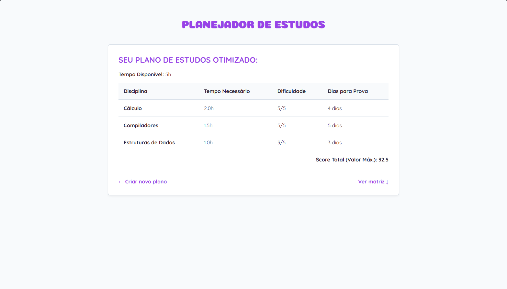
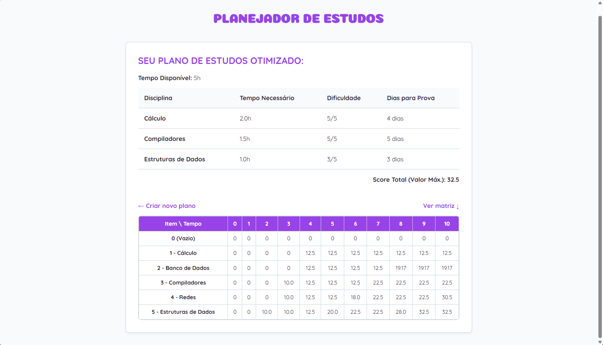

# Planejador de Estudos

Número da Lista: 35<br>
Conteúdo da Disciplina: Programação Dinâmica<br>

## Alunos
|Matrícula | Aluno |
| -- | -- |
| 21/1061860 | Henrique Martins Alencar |

## Vídeo de Apresentação

* 

## Sobre 

O Planejador de Estudos é uma aplicação web focada em otimizar a rotina de alunos que dispôem de tempo limitado. O usuário informa quanto tempo tem disponível e quais matérias deseja estudar, informando sua dificuldade e proximidade da prova. O projeto utiliza o algoritmo da **Mochila 0/1** para calcular o melhor cenário de estudos.

## Screenshots

### Página Inicial



### Resultado



### Matriz



## Instalação 
Linguagem: Python, HTML, CSS, JavaScript <br>
Framework: Flask <br>

### Pré-requisitos:

* Python 3.x

* Pip.

### Instalação e execução:

* Clone este repositório:

```bash
git clone https://github.com/projeto-de-algoritmos-2026/G35_Programacao_Dinamica_PA-26.1
cd G35_Programacao_Dinamica_PA-26.1
```

* Instale o Flask:

```bash
pip install flask
```

* Execute o servidor local:

```bash
python app.py
```

## Uso 

* Acesse o endereço: http://127.0.0.1:5000
* Informe as horas disponíveis
* Cadastre as disciplinas
* Clique em gerar plano
* Após o resultado, pode conferir a matriz